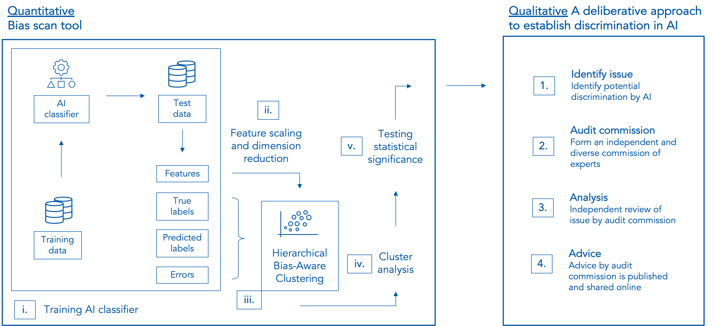

# Fairness through discussion: A deliberative way forward

☁️ This bias scan tool is available as an AWS web application: https://www.algorithmaudit.eu/bias_scan/. 

📄 Methodology: [bias scan report](https://github.com/NGO-Algorithm-Audit/Bias_scan/blob/master/Bias_scan_tool_report.pdf).

## Key takeaways – Why this bias scan?

- No data needed on protected attributes of users (unsupervised bias detection); 
- Model-agnostic (for binary AI classifiers); 
- Connecting the quantitative and qualitative reasoning paradigm to assess fair AI;
- Developed open-source and not-for-profit.

## Executive summary
Artificial intelligence (AI) is increasingly used to automate or support policy decisions that affects individuals and groups. It is imperative that AI adheres to the legal and ethical requirements that apply to such policy decisions. In particular, policy decisions should not be systematically discriminatory (direct or indirect) with respect to protected attributes such as gender, sex, ethnicity or race.

To achieve this, we propose a scalable, model-agnostic, and open-source bias scan tool to identify potentially discriminated groups of similar users in binary AI classifiers. This bias scan tool does not require *a priori* information about existing disparities and protected attributes, and is therefore able to detect possible proxy discrimination, intersectional discrimination and other types of differentiation that evade non-discrimination law. The tool is available as a web application, available on the [website](https://www.algorithmaudit.eu/bias_scan/) of NGO Algorithm Audit, such that it can be used by a wide public.

As demonstrated on a BERT-based Twitter disinformation detection model, the bias scan tool identifies statistically significant disinformation classification bias against users with a verified profile, tweets with an above average sentiment score and below average number URLs used in their messages. For a XGBoost loan approval model on the German Credit data set, statistically significant approval bias is observed on the basis of real estate ownership, negative account balance, unskilled job status and loans used to buy a new car or radio/television.

These observations do not establish prohibited *prima facie* discrimination. Rather, the identified disparities serve as a starting point to assess potential discrimination according to the context-sensitive legal doctrine, i.e., assessment of the legitimacy of the aim pursued and whether the means of achieving that aim are appropriate and necessary. For this qualitative assessment, we propose an expert-oriented deliberative method. Which allows policy makers, journalist, data subjects and other stakeholders to publicly review identified quantitative disparities against the requirements of non-discrimination law and ethics. In our two-pronged quantitative-qualitative solution, scalable statistical methods work in tandem with the normative capabilities of human subject matter experts to define fair AI on a case-by-case basis (see the solution overview Figure below). 

<sub>**Note**: The implemented bias scan tool is based on the k-means Hierarchical Bias-Aware Clustering (HBAC) method as described in Misztal-Radecka, Indurkya, *Information Processing and Management*. Bias-Aware Hierarchical Clustering for detecting the discriminated groups of users in recommendation systems (2021). Additional research indicates that k-means HBAC, in comparison to other clustering algorithms, works best to detect bias in real-world datasets.</sub>

## Solution overview


## Input data
A .csv file of max. 10mb, with columns structured as follows: features, predicted labels, truth labels. Only the order, not the naming, of the columns is of importance.

- **Features**: unscaled numeric values, e.g., *feat_1, feat_2, ..., feat_n;*
- **Predicted label**: 0 or 1;
- **Truth label**: 0 or 1.

| feat_1 | feat_2 | ... | feat_n | pred_label | truth_label |
|--------|--------|-----|--------|------------|-------------|
| 10     | 1      | ... | 0.1    | 1          | 1           |
| 20     | 2      | ... | 0.2    | 1          | 0           |
| 30     | 3      | ... | 0.3    | 0          | 0           |

## Output – Cluster differences

### Case study 1 – BERT-based disinformation classifier (Twitter data set)


Statistical significant differences in features between cluster with most negative bias (cluster 4, bias=-0.27) and rest of dataset:
| feature         | difference | p-value |
|-----------------|------------|---------|
| verified        | 0.53468    | 0.00000 |
| sentiment_score | 0.95686    | 0.00005 |
| #URLs           | -0.74095   | 0.00005 |

More details on this case study can be found [here](https://github.com/NGO-Algorithm-Audit/Bias_scan/blob/master/HBAC_scan/HBAC_BERT_disinformation_classifier.ipynb). 

#### Conclusion
Tweets of users with a verified profile, above average sentiment score and below average number of URLs used in their tweets are classified significantly more often as disinformation by the BERT-based classifier. Next, with the help of subject matter experts a qualitative assessment is needed to examine the measured quantitative disparities further.

### Case study 2 – XGBoost loan  approval classifier (German Credit data set)


Statistical significant differences in features between cluster with most negative bias (cluster 4, bias=-0.05) and rest of dataset. Note that the identified negative bias is not that much (-0.05, on a scale between [-1,1]). For sake of completeness differences in features are provided and statistically tested: 
| feature                                   | difference | p-value |
|-------------------------------------------|------------|---------|
| telephone registered                      | -1.33051   | 0.00000 |
| unknown/no property                       | -0.68001   | 0.00000 |
| self-employed/highly qualified employee   | -0.65643   | 0.00000 |
| free housing                              | -0.58238   | 0.00000 |
| credit amount                             | -0.56406   | 0.00000 |

More details on this case study can be found [here](https://github.com/NGO-Algorithm-Audit/Bias_scan/blob/master/HBAC_scan/HBAC_loan_approval_classifier.ipynb). 

#### Conclusion
This means that loan applicants without real estate or unknown/no property, negative balance, unskilled job status, or those who want to use a loan to buy a new car or radio/television are significantly less often approved by the XGBoost classifier. Next, with the help of subject matter experts a qualitative assessment is needed to examine the measured quantitative disparities further.

### Structure of this repository
```
    .
    ├── bias_scan_tool              # Bias scan tool 
    ├── classification_models       # Classifiers
    ├── data                        # Twitter and credit data sets
    ├── images                      # Images
    ├── literature                  # Reference materials
    ├── .gitattributes              # To store large files
    ├── .gitignore                  # Files to be ignored in this repo
    ├── Bias_scan_tool_report.pdf   # Main deliverable
    ├── LICENSE                     # MIT license for sharing 
    └── README.md                   # Read me file 
    
```

## Contributors to this project
- Jurriaan Parie, Trustworthy AI data scientist at IBM;
- Ariën Voogt, PhD-candidate in Philosophy at Protestant Theological University of Amsterdam;
- Joel Persson, PhD-candidate in Applied Data Science at ETH Zürich;
- dr. Vahid Niamadpour, PhD-candidate in Linguistics at Leiden University
- Floris Holstege, PhD-candidate in Explanable Machine Learning at University of Amsterdam.