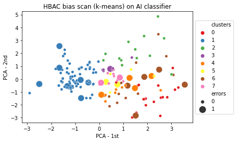

# Fairness through discussion: A deliberative way forward

The main deliverable of this submission is: [bias scan tool report](https://github.com/NGO-Algorithm-Audit/AI_Audit_Challenge/blob/master/Bias_scan_tool_report.docx).

## Results

- Take away 1
- Take away 2
- Take away 3   

## Summary
As AI is omnipresent in digital society, there is an urgent need to review algorithms with respect to the qualitative requirements of law and ethics. To facilitate this time-consuming endeavour, we propose a scalable, model-agnostic, and open-source bias scan tool to identify potentially discriminated groups of similar users in AI systems. This bias scan tool does not require a priori information about existing disparities and sensitive attributes, and is therefore able to detect possible proxy discrimination, intersectional discrimination and other types of differentiation that evade non-discrimination law. 

As demonstrated on a BERT-based Twitter disinformation detection model, the bias scan tool identifies statistically significant disinformation classification bias against users with an unverified profile and an above average number of mentions and hashtags used in tweets. On the German Credit data set, statistically significant loan approval bias is observed on the basis of applicants’ job status, telephone registration and the amount of credit requested. 

These observations do not establish prohibited prima facie discrimination. Rather, the identified disparities serve as a starting point to assess potential discrimination according to the context-sensitive legal doctrine, i.e., assessment of the legitimacy of the aim pursued and whether the means of achieving that aim are appropriate and necessary. For this qualitative assessment, we propose an expert-oriented deliberative method to review identified quantitative disparities against the requirements of non-discrimination law and ethics. In our two-pronged quantitative-qualitative solution, scalable statistical methods work in tandem with the normative capabilities of human subject matter experts to define fair AI on a case-by-case basis.


\* <sub>The implemented bias scan tool is based on the k-means Hierarchical Bias-Aware Clustering (HBAC) method as described in Misztal-Radecka, Indurkya, *Information Processing and Management*. Bias-Aware Hierarchical Clustering for detecting the discriminated groups of users in recommendation systems (2021).</sub>





### Structure of this repository
```
    .
    ├── bias_scan_tool              # Bias scan tool 
    ├── classification_models       # Classifiers
    ├── data                        # Twitter and credit data sets
    ├── images                      # Images
    ├── literature                  # Reference materials
    ├── .gitattributes              # To store large files
    ├── .gitignore                  # Files to be ignored in this repo
    ├── Bias_scan_tool_report.pdf   # Main deliverable
    ├── LICENSE                     # MIT license for sharing 
    └── README.md                   # Read me file 
    
```


## About this submission
- Jurriaan Parie, Trustworthy AI data scientist at IBM
- Ariën Voogt, PhD-candidate in Philosophy at Protestant Theological University of Amsterdam
- dr. Vahid Niamadpour, PhD-candidate in Linguistics at Leiden University
- ...